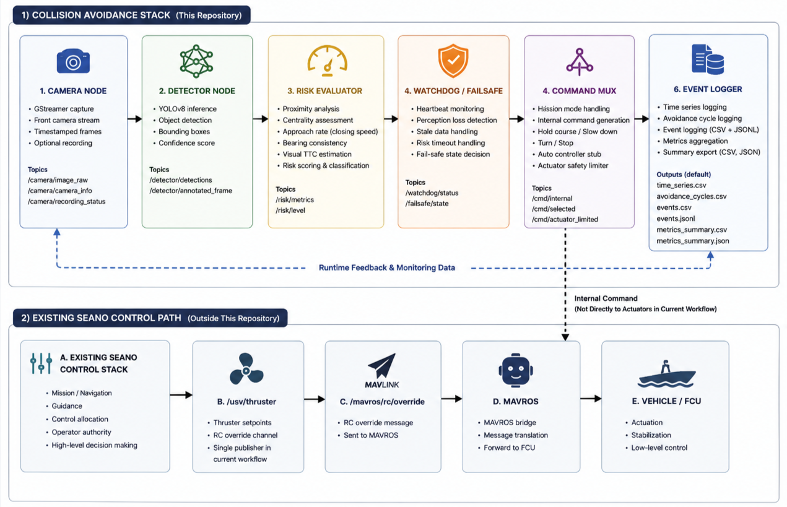
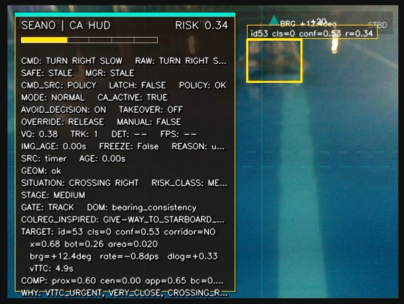

# seano-collision-avoidance


Vision-based collision avoidance stack for the SEANO Unmanned Surface Vehicle (USV). The system performs camera-based obstacle perception, risk evaluation, and internal avoidance decision-making, with structured logging for field-test analysis.



Conceptual overview of the current field-test workflow. The collision avoidance stack performs perception, risk evaluation, internal command generation, monitoring, and logging, while physical actuation remains handled by the existing SEANO control path.

## Table of Contents

- [Overview](#overview)
- [Current Operating Mode](#current-operating-mode)
- [Features](#features)
- [Quick Start](#quick-start)
- [Field-Test Preflight](#field-test-preflight)
- [Runtime Outputs](#runtime-outputs)
- [Runtime HUD Example](#runtime-hud-example)
- [Repository Structure](#repository-structure)
- [Main Runtime Nodes](#main-runtime-nodes)
- [Documentation](#documentation)
- [Safety Notes](#safety-notes)
- [Development Checks](#development-checks)
- [License](#license)

## Overview

This repository contains the ROS 2 workspace used for obstacle perception, risk evaluation, avoidance decision logic, runtime monitoring, and structured field-test logging. The system is designed to support safe USV operation by detecting visual obstacles, estimating collision risk, and producing internal avoidance commands that can be reviewed, logged, and integrated with the vehicle control stack.

Target platform:

- NVIDIA Jetson Orin
- ROS 2 Humble
- Python-based ROS 2 nodes
- YOLOv8 perception model
- MAVROS-compatible vehicle environment
- SEANO existing vehicle control stack

## Current Operating Mode

The recommended field-test configuration uses the existing SEANO vehicle control path for physical actuation.

In this mode:

- the collision avoidance stack runs camera perception, detection, risk scoring, internal command generation, and logging;
- the existing SEANO control stack remains responsible for physical actuation;
- `/usv/thruster` remains the only publisher to `/mavros/rc/override`;
- `mavros_rc_override_bridge_node` from this repository is intentionally disabled;
- no new MAVROS instance is launched by this repository.

This configuration avoids duplicate RC override publishers while still producing complete perception, risk, command, and event logs for analysis.

## Features

- Camera-based obstacle detection using YOLOv8.
- Risk evaluation based on proximity, centrality, approach, bearing consistency, and visual time-to-collision indicators.
- Risk-class and command generation for hold-course, slow-down, turn, and stop decisions.
- Watchdog and perception-loss fail-safe handling.
- Structured runtime logging for time-series data, avoidance cycles, events, and summary metrics.
- Field-test run script for existing-control-path operation.
- Optional full-profile perception nodes for extended experiments and future integration.

## Quick Start

Use the existing-control-path field-test script:

```bash
cd seano_ca_ws
./run_pool_existing_control_path.sh
```

Stop the run with:

```text
Ctrl+C
```

Use `Ctrl+C` in the same terminal that started the script. This stops the collision avoidance launch process started by this repository. It does not stop the existing SEANO control services.

Do not use `run_phase7_monitor_no_log.sh` for the current existing-control-path field-test workflow. That script belongs to an older operational path and does not represent the current recommended logging and no-bridge configuration.

## Field-Test Preflight

Before running a field test, verify:

- MAVROS is connected.
- Vehicle mode is not RTL unless the operator explicitly intends that state.
- `/usv/thruster` is the only publisher to `/mavros/rc/override`.
- No `mavros_rc_override_bridge_node` from this repository is already running.
- Camera and detector are physically ready.
- Operator/manual authority is available.
- Test area is clear and safe.
- The vehicle control operator understands that physical actuation remains under the existing SEANO control stack.

The run script performs conservative preflight checks before launching the collision avoidance stack.

## Runtime Outputs

The event logger writes structured files under the configured event log directory.

Important outputs include:

| File | Purpose |
|---|---|
| `time_series.csv` | Per-sample perception, risk, command, status, and metric data. |
| `avoidance_cycles.csv` | Per-cycle timing, response, and avoidance summary data. |
| `metrics_summary.csv` | Aggregated metric summary in CSV format. |
| `metrics_summary.json` | Aggregated metric summary in JSON format. |
| `events.csv` | Human-readable event log. |
| `events.jsonl` | JSON lines event log for programmatic analysis. |

Frame capture is disabled by default for the current workflow.

## Runtime HUD Example

<details>
<summary>Runtime HUD example</summary>



Example runtime HUD showing obstacle tracking, risk score, command state, fail-safe status, and collision-avoidance decision context during a field run.

</details>

## Repository Structure

<details>
<summary>Repository tree</summary>

```text
.
├── AGENTS.md
├── PRD.md
├── SKILLS.md
├── README.md
├── docs/
│   ├── assets/
│   │   ├── seano_ca_system_overview.png
│   │   └── seano_ca_runtime_hud_example.png
│   ├── CLEANUP_NOTES.md
│   ├── REPO_MAP.md
│   └── RUNBOOK_POOL_EXISTING_CONTROL_PATH.md
└── seano_ca_ws/
    ├── run_pool_existing_control_path.sh
    ├── scripts/
    └── src/
        └── seano_vision/
            ├── launch/
            ├── config/
            ├── models/
            └── seano_vision/
```

</details>

## Main Runtime Nodes

### Active in current workflow

The current existing-control-path workflow uses the core collision avoidance pipeline:

- `camera_node.py`
- `detector_node.py`
- `risk_evaluator_node.py`
- `watchdog_failsafe_node.py`
- `command_mux_node.py`
- `actuator_safety_limiter_node.py`
- `auto_controller_stub_node.py`
- `mission_mode_manager_node.py`
- `event_logger_node.py`

### Optional full-profile nodes

Retained for extended configurations and should not be removed:

- `vision_quality_node.py`
- `false_positive_guard_node.py`
- `frame_freeze_detector_node.py`
- `multi_target_fusion_node.py`
- `waterline_horizon_node.py`

## Documentation

| File | Description |
|---|---|
| `PRD.md` | Product requirements and system goals. |
| `AGENTS.md` | Operational guidance for AI-assisted development in this repository. |
| `SKILLS.md` | Repository-specific development and verification skills. |
| `docs/REPO_MAP.md` | Detailed repository map and node classification. |
| `docs/RUNBOOK_POOL_EXISTING_CONTROL_PATH.md` | Field-test runbook for the existing-control-path workflow. |
| `docs/CLEANUP_NOTES.md` | Cleanup policy and generated-file handling notes. |

## Safety Notes

This repository is used around a real vehicle platform. Treat launch files, actuator interfaces, fail-safe logic, and RC override paths as safety-critical.

Key rules:

- Do not run multiple publishers to `/mavros/rc/override`.
- The direct RC override bridge must remain disabled for the existing-control-path workflow.
- Operator/manual authority must remain available at all times during field testing.
- Review logs after each run before making further changes.

## Development Checks

Common non-hardware checks:

```bash
cd seano_ca_ws
source /opt/ros/humble/setup.bash
colcon build --symlink-install
```

Python syntax check:

```bash
python3 -m compileall -q seano_ca_ws/src/seano_vision/seano_vision
```

Script syntax check:

```bash
bash -n seano_ca_ws/run_pool_existing_control_path.sh
```

## License

No license has been specified yet.
