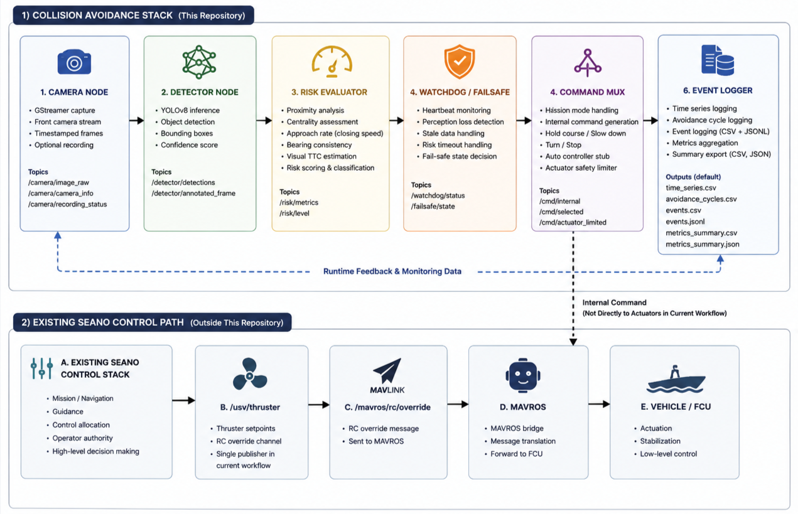

# SEANO Collision Avoidance

Vision-based collision avoidance for the SEANO Unmanned Surface Vehicle (USV), implemented as a ROS 2 Humble workspace on NVIDIA Jetson.

The current system integrates camera acquisition, YOLOv8n TensorRT inference, visual collision-risk evaluation, guarded avoidance-command execution, operator-authority handling, AUTO-to-MANUAL takeover, return-to-AUTO recovery, browser-based monitoring, and structured runtime logging.

> **Primary operational entry point**
>
> ```bash
> cd ~/resource_git/seano-collision-avoidance2/seano_ca_ws
> ./run_ca.sh
> ```
>
> For normal operation, developers and operators should use `run_ca.sh`.
> The lower-level runners are retained for diagnostics, validation, and compatibility testing.



---

## 1. System Overview

The active SEANO collision-avoidance runtime is designed around the following control sequence:

```text
Jetson / CA runtime starts
        |
        v
Camera + detector + risk + watchdog + HUD become ready
        |
        v
CONTROL STANDBY
        |
        | operator provides AUTO + ARMED
        v
AUTO_MISSION_MONITORING
        |
        | obstacle / hazard confirmed
        v
AUTO -> MANUAL takeover
        |
        v
Collision avoidance command
HOLD / SLOW / TURN / STOP
        |
        v
Hazard clears
        |
        v
Neutral / release
        |
        v
MANUAL -> AUTO restoration
        |
        v
AUTO_MISSION_MONITORING
```

The runtime does **not** require the vehicle to be in a specific control mode when the CA process is started.

The perception and decision pipeline may run while the vehicle is:

```text
MANUAL + DISARMED
MANUAL + ARMED
AUTO   + DISARMED
AUTO   + ARMED
other operator-selected modes
```

Physical collision-avoidance authority is only eligible after the complete runtime is healthy and the vehicle reaches:

```text
AUTO + ARMED + SOFTWARE_READY
```

This separation allows the operator to start the CA system, inspect the camera/HUD/detection pipeline, and only arm or select AUTO when the vehicle and test environment are ready.

---

## 2. Primary Runtime

The primary launcher is:

```bash
seano_ca_ws/run_ca.sh
```

`run_ca.sh` is the operator-facing wrapper around the guarded AUTO-takeover runtime.

It handles:

- ROS 2 Humble environment setup;
- `ROS_DOMAIN_ID=0`;
- workspace sourcing;
- first-time build when `install/setup.bash` does not exist;
- MQTT configuration validation;
- operator safety confirmation;
- read-only preflight through the underlying AUTO-takeover runner;
- browser HUD startup;
- professional console filtering;
- runtime launch;
- safe foreground shutdown handling.

### Normal startup

After the Jetson and the external SEANO services have finished starting:

```bash
cd ~/resource_git/seano-collision-avoidance2/seano_ca_ws

./run_ca.sh
```

The launcher displays the safety checklist and asks:

```text
Ketik YES untuk menjalankan CA:
```

Enter:

```text
YES
```

No additional environment exports are required during normal operation on the current SEANO Jetson configuration.

### Stop the runtime

Use:

```text
Ctrl+C
```

in the terminal that started `run_ca.sh`.

The CA launcher must not be terminated by killing unrelated external SEANO services.

---

## 3. Launcher Modes

### Normal guarded runtime

```bash
./run_ca.sh
```

Starts the complete guarded AUTO-takeover collision-avoidance runtime.

### Dry check

```bash
./run_ca.sh --dry-check
```

Validates the static runtime configuration without:

- starting ROS nodes;
- opening an MQTT connection;
- publishing an MQTT command;
- requesting an FCU mode change;
- arming or disarming the FCU.

The current dry-check policy reports:

```text
startup_control_state=non_blocking
actuation_gate=AUTO+ARMED+SOFTWARE_READY
```

### Read-only preflight

```bash
./run_ca.sh --preflight-only
```

Checks the external runtime interface without starting the CA nodes.

A valid preflight should end with:

```text
Ready for guarded AUTO takeover procedure: true
```

The FCU mode and arm state shown during preflight are informational. They are not startup blockers.

### Rebuild before run

```bash
./run_ca.sh --rebuild
```

Rebuilds `seano_vision`, sources the resulting workspace, and then continues into the normal guarded runtime.

Use this after changing Python nodes, launch files, configuration files, or package definitions.

### Verbose console

```bash
./run_ca.sh --verbose
```

Runs the same guarded runtime but keeps the full raw ROS console output visible.

The default `run_ca.sh` mode uses:

```text
scripts/ca_pretty_console.py
```

to show operator-relevant states, warnings, safety events, HUD information, and errors while suppressing repetitive telemetry.

The complete raw session logs are still retained in `runtime_artifacts`.

---

## 4. External System Boundary

The current runtime intentionally reuses infrastructure that already exists outside this repository.

### External components reused by this repository

- MAVROS instance started by the main SEANO system;
- `/usv/thruster`;
- FCU/autopilot connection;
- `/mavros/set_mode`;
- vehicle startup services;
- MQTT infrastructure.

### Important ownership rule

`/usv/thruster` must remain the **sole publisher** to:

```text
/mavros/rc/override
```

The active AUTO-takeover profile uses:

```text
use_mavros=false
use_rc_override_bridge=false
use_mode_manager=false
```

The sole FCU mode owner inside this collision-avoidance runtime is:

```text
auto_takeover_manager_node
```

Do not start another MAVROS instance or another RC-override publisher from this repository while the external SEANO control system is active.

---

## 5. Operator Authority

Operator authority has priority over collision avoidance.

The CA process is designed to remain alive when the operator:

- switches from AUTO to MANUAL;
- disarms the vehicle;
- arms the vehicle again;
- selects another operator-controlled mode;
- returns from MANUAL to AUTO.

These actions do not require restarting `run_ca.sh`.

When operator control interrupts CA authority, the state machine enters:

```text
OPERATOR_OVERRIDE
```

Typical blocked reasons include:

```text
WAIT_FCU_CONNECTION
WAIT_OPERATOR_AUTO
WAIT_OPERATOR_ARM
CONTROL_STANDBY
```

When the system later reaches:

```text
FCU connected
AUTO
ARMED
SOFTWARE_READY
```

the CA runtime may return to:

```text
AUTO_MISSION_MONITORING
```

This recovery is designed to work repeatedly, not only once per runtime session.

Safety faults in control paths that CA currently owns remain fail-closed and are not treated as ordinary operator overrides.

---

## 6. AUTO-Takeover Behaviour

During normal mission monitoring:

```text
AUTO_MISSION_MONITORING
```

the CA pipeline continuously evaluates the selected collision-avoidance command.

A persistent hazard is debounced before takeover.

Current hazard commands include:

```text
SLOW_DOWN
TURN_LEFT_SLOW
TURN_RIGHT_SLOW
TURN_LEFT
TURN_RIGHT
STOP
```

A guarded avoidance cycle conceptually follows:

```text
AUTO_MISSION_MONITORING
        |
        v
hazard confirmed
        |
        v
TAKEOVER_REQUESTED
        |
        v
request MANUAL
        |
        v
WAITING_FOR_MANUAL_CONFIRMATION
        |
        v
AVOIDANCE_READY
        |
        v
MOTION_COMMAND_PENDING / MOTION_ACTIVE / STOP_ACTIVE
        |
        v
CLEAR_HOLD
        |
        v
neutral + release
        |
        v
AUTO restore
        |
        v
AUTO_REJOIN_VERIFY
        |
        v
AUTO_MISSION_MONITORING
```

No physical motion is permitted solely because a risk command exists.

Motion remains dependent on the complete safety gate, including FCU state, command freshness, perception validity, MQTT availability, RC path validity, adapter health, foreign-command checks, and delivery evidence.

---

## 7. Perception and Decision Pipeline

The active pipeline is:

```text
USB Camera
    |
    v
camera_node
    |
    v
YOLOv8n TensorRT
detector_node
    |
    v
/camera/detections
    |
    v
risk_evaluator_node
    |
    +--> /ca/risk
    +--> /ca/command
    +--> /ca/mode
    +--> /ca/metrics
    |
    v
watchdog_failsafe_node
    |
    +--> /ca/command_safe
    +--> /ca/failsafe_active
    |
    v
command / actuator safety path
    |
    v
auto_takeover_manager_node
    |
    v
guarded external control path
```

The collision-risk evaluator uses five principal visual factors:

1. proximity;
2. centrality;
3. approach;
4. bearing consistency;
5. visual time-to-collision (`vTTC`).

The evaluator also publishes detailed features including:

```text
x_ratio
bottom_y_ratio
area_ratio
bearing_deg
bearing_rate_dps
dlog_area_dt
vttc_s
```

---

## 8. Visual Freshness Handling

Visual freshness is intentionally evaluated using both the direct image path and detector-derived visual evidence.

The evaluator tracks:

```text
img_age_s
det_age_s
visual_age_s
visual_fresh_source
```

The effective visual age is:

```text
visual_age = min(img_age, det_age)
```

This prevents a delayed raw-image callback from being interpreted as complete visual loss when the detector is still processing fresh frames.

A true visual timeout occurs when the effective visual evidence becomes stale according to the configured timeout and other lost-perception conditions.

This preserves the fail-safe behaviour:

```text
valid visual evidence
        -> NORMAL / CAUTION

visual evidence lost
        -> LOST_PERCEPTION
        -> failsafe STOP
```

---

## 9. Active Vision Configuration

The active hardware profile is:

```text
seano_ca_ws/src/seano_vision/config/alfin7_hardware_light.yaml
```

Current geometry and risk configuration:

| Parameter | Current value |
|---|---:|
| Expected image | 640 × 480 |
| Camera HFOV | 67.5° |
| CENTER band ratio | 0.35 |
| CENTER equivalent bearing | approximately ±11.8125° |
| Bottom danger ratio | 0.55 |
| Near area ratio | 0.010 |
| Risk evaluator minimum detection score | 0.45 |
| Enter avoidance risk | 0.45 |
| Exit avoidance risk | 0.28 |
| Slow threshold | 0.35 |
| Turn-slow threshold | 0.45 |
| Turn threshold | 0.60 |
| Stop threshold | 0.78 |
| vTTC turn threshold | 6.0 s |
| vTTC stop threshold | 2.0 s |
| Risk EMA alpha | 0.45 |
| Track timeout | 0.60 s |
| Detection stale timeout | 0.60 s |
| Visual freshness timeout | 1.20 s |

The detector and risk evaluator use different filtering stages.

The detector runtime currently uses:

```text
confidence threshold: 0.20
IoU threshold:        0.45
maximum detections:   50
detector max rate:    8 FPS
```

The risk evaluator then applies its own minimum accepted detection score from the active hardware profile.

---

## 10. TensorRT Model

The operational detector uses:

```text
YOLOv8n
TensorRT engine
FP16
416 × 416
batch size 1
```

Runtime model:

```text
seano_ca_ws/src/seano_vision/models/yolov8n.engine
```

Source model:

```text
seano_ca_ws/src/seano_vision/models/yolov8n.pt
```

The `.engine` file is generated locally on the target Jetson and is not intended to be portable between arbitrary GPU/CUDA/TensorRT environments.

A fresh Jetson deployment must therefore ensure that a compatible:

```text
yolov8n.engine
```

exists before field operation.

---

## 11. Current Guarded Motion Configuration

The AUTO-takeover runner validates the following control configuration before a real run.

| Parameter | Current value |
|---|---:|
| Mapping profile | `SEAPORTAL_ACTUAL` |
| Steering channel index | 0 |
| Throttle channel index | 2 |
| PWM minimum | 1000 |
| PWM neutral | 1500 |
| PWM maximum | 2000 |
| Cruise reference | 100% |
| Slow factor | 0.58 |
| Slow throttle | 58% |
| Minimum effective throttle | 58% |
| Turn throttle | 0% |
| Maximum guarded test throttle | 58% |
| Maximum steering | 100% |
| Maximum continuous motion window | 2.0 s |
| Command freshness watchdog | 2.0 s |
| Motion delivery timeout | 0.75 s |
| Startup grace | 8.0 s |
| Hazard debounce | 0.4 s |
| Clear hold | 2.5 s |
| Mode confirmation timeout | 3.0 s |
| Mode retry interval | 1.0 s |
| AUTO rejoin verification | 0.5 s |
| Release timeout | 1.0 s |
| Final release timeout | 0.5 s |
| Maximum mode requests | 3 |

These values are guarded by runtime validation and automated tests.

Do not modify physical-control limits without reviewing the control mapping, tests, safety assumptions, and field-test procedure together.

---

## 12. MQTT Configuration

MQTT credentials must remain outside this repository.

The current SEANO Jetson launcher expects:

```text
/home/seano/Seano_ws/src/seano_startup/config/system.yaml
```

`run_ca.sh` verifies that the file:

- exists;
- is readable;
- is not a symbolic link.

The secure MQTT credential loader also validates the credential source before the guarded runtime starts.

### Important for another Jetson or developer environment

The current MQTT configuration path is deployment-specific.

If the repository is moved to another Jetson or another SEANO installation, review:

```text
seano_ca_ws/run_ca.sh
```

and update the deployment-specific MQTT configuration path before running the vehicle.

Do not commit usernames, passwords, certificates, or private MQTT configuration files.

---

## 13. HUD and Runtime Monitoring

Primary AUTO-takeover HUD topic:

```text
/ca/auto_takeover/debug_image
```

Browser stream:

```text
http://<JETSON_IP>:8080/stream?topic=/ca/auto_takeover/debug_image
```

The AUTO-takeover HUD displays information such as:

```text
runtime state
FCU mode
arming state
desired command
mapped command
takeover status
AUTO restore status
MQTT/RC evidence
throttle and steering request
blocked reason
abort reason
```

Primary status topic:

```text
/ca/auto_takeover/status_json
```

Useful runtime inspection:

```bash
ros2 topic echo /ca/auto_takeover/status_json --once
```

Manager publication rate:

```bash
ros2 topic hz /ca/auto_takeover/status_json
```

Risk metrics:

```bash
ros2 topic echo /ca/metrics
```

Watchdog status:

```bash
ros2 topic echo /ca/watchdog_status
```

Camera rate:

```bash
ros2 topic hz /seano/camera/image_raw_reliable
```

Detector rate:

```bash
ros2 topic hz /camera/detections
```

HUD rate:

```bash
ros2 topic hz /ca/auto_takeover/debug_image
```

---

## 14. Runtime Logs

Each real AUTO-takeover session creates:

```text
runtime_artifacts/POOL_AUTO_TAKEOVER_TEST_<TIMESTAMP>/
```

Typical contents include:

```text
terminal.log
ros_logs/
event_logs/
auto_takeover_logs/
web_video_server.log
```

The raw terminal log remains available even when the normal professional console hides repetitive ROS telemetry.

Use:

```bash
./run_ca.sh --verbose
```

when direct raw console output is needed during debugging.

Runtime artifacts must not be committed to Git.

---

## 15. Build and Verification

### Standard build

```bash
cd ~/resource_git/seano-collision-avoidance2/seano_ca_ws

source /opt/ros/humble/setup.bash

colcon build --symlink-install --packages-select seano_vision

source install/setup.bash
```

### Python syntax

```bash
python3 -m compileall -q src/seano_vision/seano_vision
```

### Runner syntax

```bash
bash -n run_ca.sh
bash -n run_pool_auto_takeover_test.sh
bash -n run_pool_existing_control_path.sh
bash -n run_pool_thruster_hardware_test.sh
```

### Automated tests

```bash
python3 -m pytest src/seano_vision/test -q
```

Before the current operational baseline was committed, the complete test suite passed:

```text
308 passed
```

Any change to the state machine, actuator path, mode ownership, MQTT safety, risk logic, or launch configuration should be followed by a complete test run.

---

## 16. Supporting Runners

The following scripts remain in the repository for diagnostics and compatibility.

### Primary lower-level AUTO runner

```text
run_pool_auto_takeover_test.sh
```

This is the guarded runtime used internally by:

```text
run_ca.sh
```

Normal operators should use `run_ca.sh` rather than calling this script directly.

### Safe preview baseline

```text
run_pool_existing_control_path.sh
```

Used for non-hardware preview and diagnostic work.

It must not be run at the same time as the primary AUTO-takeover runtime.

### Guarded MANUAL thruster diagnostic

```text
run_pool_thruster_hardware_test.sh
```

Used for dedicated MANUAL-mode thruster-path diagnostics.

It is not the normal collision-avoidance runtime.

---

## 17. Repository Structure

```text
seano-collision-avoidance/
|
├── README.md
├── PRD.md
├── AGENTS.md
├── SKILLS.md
├── docs/
│   └── assets/
│
└── seano_ca_ws/
    ├── README.md
    ├── run_ca.sh                         # PRIMARY OPERATOR ENTRY POINT
    ├── run_pool_auto_takeover_test.sh    # underlying guarded AUTO runtime
    ├── run_pool_existing_control_path.sh # preview / diagnostic
    ├── run_pool_thruster_hardware_test.sh
    │
    ├── scripts/
    │   ├── ca_pretty_console.py
    │   └── summarize_tegrastats.py
    │
    └── src/
        └── seano_vision/
            ├── config/
            ├── launch/
            ├── models/
            ├── resource/
            ├── seano_vision/
            └── test/
```

Important runtime files:

```text
seano_ca_ws/run_ca.sh
seano_ca_ws/run_pool_auto_takeover_test.sh

seano_ca_ws/src/seano_vision/launch/auto_takeover_test.launch.py
seano_ca_ws/src/seano_vision/launch/phase7_cuav_usb_hardware.launch.py

seano_ca_ws/src/seano_vision/config/alfin7_hardware_light.yaml

seano_ca_ws/src/seano_vision/seano_vision/auto_takeover_manager_node.py
seano_ca_ws/src/seano_vision/seano_vision/auto_takeover_state.py
seano_ca_ws/src/seano_vision/seano_vision/risk_evaluator_node.py
seano_ca_ws/src/seano_vision/seano_vision/watchdog_failsafe_node.py
seano_ca_ws/src/seano_vision/seano_vision/guarded_thruster_test_adapter_node.py
```

---

## 18. Development Rules

Changes to this repository should preserve the following invariants:

1. Do not start a second MAVROS instance during the active SEANO deployment.
2. Do not create a second publisher to `/mavros/rc/override`.
3. `/usv/thruster` remains the external RC-override owner.
4. Operator MANUAL authority must take priority over CA authority.
5. DISARM must remain an operator/safety action.
6. CA must not produce physical movement before all motion gates are valid.
7. Real safety faults must remain fail-closed.
8. MQTT credentials must remain outside the repository.
9. Runtime artifacts must remain outside Git history.
10. A full automated test run is required after safety-critical changes.

For changes involving:

```text
auto_takeover_state.py
auto_takeover_manager_node.py
guarded_thruster_test_adapter_node.py
thruster_test_safety.py
run_pool_auto_takeover_test.sh
```

review both the nominal control path and failure/recovery behaviour before field deployment.

---

## 19. Recommended Developer Workflow

For a new change:

```text
1. Pull latest main.
2. Read this README and the active launch/config files.
3. Modify only the intended repository components.
4. Run syntax checks.
5. Run the complete pytest suite.
6. Run ./run_ca.sh --dry-check.
7. Run ./run_ca.sh --preflight-only against the actual external SEANO system.
8. Perform supervised real testing only after all checks pass.
9. Review runtime_artifacts for evidence.
10. Commit and push only verified changes.
```

Do not treat a successful unit test as a substitute for supervised hardware validation.

---

## 20. Safety Notes for Field Testing

Before physical testing:

- verify battery condition;
- verify the navigation solution required by the autopilot;
- verify FCU connectivity;
- verify the external `/usv/thruster` path;
- verify emergency-stop availability;
- keep direct MANUAL operator authority available;
- ensure only one CA runtime is active;
- confirm the test area is clear.

The collision-avoidance runtime should not be used to bypass autopilot pre-arm, GPS/EKF, battery, geofence, or other vehicle-level safety checks.

Those systems remain outside the collision-avoidance repository boundary.

---

## 21. Current Deployment Assumptions

The present operational baseline assumes:

```text
Platform     : NVIDIA Jetson Orin
OS/ROS       : ROS 2 Humble environment
ROS domain   : 0
Camera       : SEANO USB camera path configured by the active hardware launch
Detector     : YOLOv8n TensorRT
Input        : 640 × 480
Inference    : 416 × 416 FP16
FCU bridge   : external MAVROS
RC owner     : /usv/thruster
HUD port     : 8080
Primary run  : ./run_ca.sh
```

These are deployment assumptions, not generic defaults for every future vehicle.

Developers porting this repository to another USV, FCU, camera, or Jetson should explicitly review the hardware launch, mapping, MQTT path, TensorRT engine, risk geometry, and safety limits.

---

## 22. License

The ROS package metadata declares the MIT license.

A repository-level `LICENSE` file should be added if this repository is distributed beyond the current development environment.
