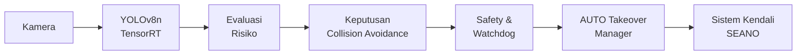
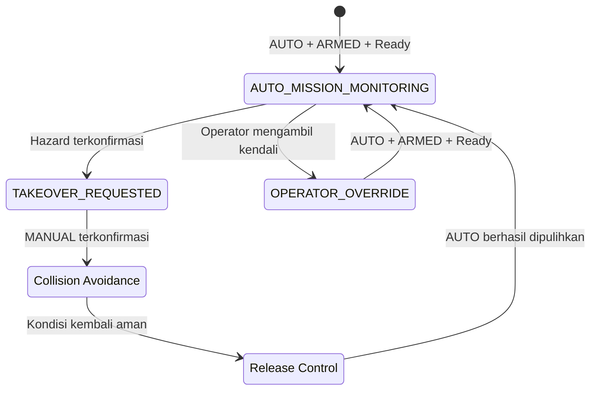

# SEANO Collision Avoidance

Sistem *collision avoidance* berbasis visi untuk **Unmanned Surface Vehicle (USV) SEANO** yang berjalan pada ROS 2 Humble dan NVIDIA Jetson.

Sistem menggunakan YOLOv8n TensorRT untuk mendeteksi objek dari kamera, mengolah hasil deteksi menjadi nilai risiko tabrakan, menentukan tindakan *collision avoidance*, serta menjalankan mekanisme *AUTO takeover* dengan tetap mempertahankan prioritas kendali operator.

## Menjalankan Sistem

Runtime utama yang digunakan saat ini adalah:

```bash
cd ~/resource_git/seano-collision-avoidance2/seano_ca_ws
./run_ca.sh
```

Sebelum sistem dijalankan, launcher akan menampilkan pemeriksaan keselamatan.

Jika seluruh kondisi pengujian sudah sesuai, ketik:

```text
YES
```

Untuk menghentikan sistem:

```text
Ctrl+C
```

`run_ca.sh` merupakan entry point utama untuk penggunaan sistem saat ini. Launcher ini menangani konfigurasi lingkungan ROS 2, workspace, MQTT, pemeriksaan awal, HUD, logging, dan runtime *AUTO takeover*.

---

## Arsitektur Sistem


```mermaid
flowchart LR
    CAM["Kamera"] --> DET["YOLOv8n<br/>TensorRT"]
    DET --> RISK["Evaluasi<br/>Risiko"]
    RISK --> DEC["Keputusan<br/>Collision Avoidance"]
    DEC --> SAFE["Safety &<br/>Watchdog"]
    SAFE --> AUTO["AUTO Takeover<br/>Manager"]
    AUTO --> CTRL["Sistem Kendali<br/>SEANO"]
```

Alur pemrosesan dibagi menjadi beberapa bagian utama.

| Tahap | Fungsi |
|---|---|
| Kamera | Mengambil citra lingkungan secara real-time |
| Deteksi | Mendeteksi objek menggunakan YOLOv8n TensorRT |
| Evaluasi risiko | Mengolah posisi, ukuran, arah gerak, dan perubahan objek |
| Pengambilan keputusan | Menentukan tindakan *collision avoidance* |
| Safety & watchdog | Memastikan data dan jalur kontrol masih valid |
| AUTO takeover | Mengatur pengambilalihan dan pelepasan kendali |
| Sistem SEANO | Menjalankan perintah melalui jalur kendali kendaraan |

---

## Evaluasi Risiko

Hasil deteksi objek diolah menjadi beberapa parameter visual:

- *proximity*
- *centrality*
- *approach*
- *bearing consistency*
- *visual time-to-collision* (*vTTC*)

Parameter tersebut digunakan untuk membentuk nilai risiko dan menentukan tindakan yang sesuai.

Perintah yang dapat dihasilkan sistem:

```text
HOLD_COURSE
SLOW_DOWN
TURN_LEFT_SLOW
TURN_RIGHT_SLOW
TURN_LEFT
TURN_RIGHT
STOP
```

Perintah yang dihasilkan oleh evaluator belum langsung menggerakkan kendaraan. Seluruh perintah tetap harus melewati mekanisme keselamatan dan kontrol sebelum diterapkan ke aktuator.

---

## Mekanisme AUTO Takeover

Sistem CA dapat dijalankan tanpa bergantung pada kondisi kontrol kendaraan saat startup.

Runtime tetap dapat aktif ketika kendaraan berada dalam kondisi:

- MANUAL dan DISARMED
- MANUAL dan ARMED
- AUTO dan DISARMED
- AUTO dan ARMED

Kamera, deteksi objek, evaluasi risiko, HUD, dan monitoring tetap dapat berjalan selama runtime aktif.

Kendali *collision avoidance* baru dapat digunakan ketika kondisi berikut terpenuhi:

```text
AUTO + ARMED + SOFTWARE_READY
```

Pada kondisi tersebut, sistem masuk ke:

```text
AUTO_MISSION_MONITORING
```

Alur pengambilalihan kendali ditunjukkan pada diagram berikut.


```mermaid
stateDiagram-v2
    [*] --> Monitoring: AUTO + ARMED + Ready

    Monitoring: AUTO_MISSION_MONITORING
    Takeover: TAKEOVER_REQUESTED
    Avoidance: Collision Avoidance
    Release: Release Control
    Override: OPERATOR_OVERRIDE

    Monitoring --> Takeover: Hazard terkonfirmasi
    Takeover --> Avoidance: MANUAL terkonfirmasi
    Avoidance --> Release: Kondisi kembali aman
    Release --> Monitoring: AUTO berhasil dipulihkan

    Monitoring --> Override: Operator mengambil kendali
    Override --> Monitoring: AUTO + ARMED + Ready
```

Sistem tidak melakukan ARM atau DISARM secara otomatis.

---

## Prioritas Kendali Operator

Operator tetap memiliki prioritas tertinggi.

Jika operator mengubah mode dari AUTO ke MANUAL atau melakukan DISARM, sistem CA tidak melakukan abort hanya karena intervensi tersebut.

Runtime tetap aktif, tetapi authority CA dilepas.

State yang digunakan untuk kondisi ini adalah:

```text
OPERATOR_OVERRIDE
```

Ketika operator kembali memberikan kondisi:

```text
AUTO + ARMED
```

dan seluruh komponen software kembali siap, sistem dapat masuk lagi ke:

```text
AUTO_MISSION_MONITORING
```

Mekanisme ini dapat dilakukan berulang kali selama runtime yang sama tanpa perlu menjalankan ulang `run_ca.sh`.

---

## Perception

Konfigurasi detector yang digunakan saat ini:

| Parameter | Konfigurasi |
|---|---|
| Model | YOLOv8n |
| Backend | TensorRT |
| Precision | FP16 |
| Input model | 416 × 416 |
| Citra kamera | 640 × 480 |
| Platform | NVIDIA Jetson |
| ROS | ROS 2 Humble |

Model TensorRT:

```text
seano_ca_ws/src/seano_vision/models/yolov8n.engine
```

Source model:

```text
seano_ca_ws/src/seano_vision/models/yolov8n.pt
```

File `.engine` dibangun untuk lingkungan Jetson yang digunakan. Jika sistem dipindahkan ke perangkat lain, kompatibilitas TensorRT, CUDA, dan GPU harus diperiksa kembali.

---

## Konfigurasi Risiko

Konfigurasi aktif kendaraan berada di:

```text
seano_ca_ws/src/seano_vision/config/alfin7_hardware_light.yaml
```

Beberapa parameter utama:

| Parameter | Nilai |
|---|---:|
| Camera HFOV | 67.5° |
| CENTER band ratio | 0.35 |
| Perkiraan area CENTER | ±11.8125° |
| Minimum detection score pada evaluator | 0.45 |
| Enter avoidance | 0.45 |
| Exit avoidance | 0.28 |
| Slow threshold | 0.35 |
| Turn slow threshold | 0.45 |
| Turn threshold | 0.60 |
| Stop threshold | 0.78 |
| Visual timeout | 1.20 s |

Area CENTER digunakan untuk mewakili area di depan kapal. Posisi objek di luar CENTER digunakan untuk membantu menentukan arah penghindaran ke sisi *port* atau *starboard*.

---

## Visual Freshness

Evaluator memonitor dua sumber informasi visual:

- penerimaan citra langsung;
- hasil deteksi yang berasal dari frame kamera.

Informasi freshness tersedia pada `/ca/metrics` melalui:

```text
img_age_s
det_age_s
visual_age_s
visual_fresh_source
```

Nilai efektif menggunakan sumber visual yang paling baru:

```text
visual_age = min(img_age, det_age)
```

Mekanisme ini mencegah keterlambatan callback citra dianggap sebagai kehilangan persepsi ketika detector masih menerima dan memproses frame baru.

Jika seluruh bukti visual melewati batas timeout, sistem masuk ke:

```text
LOST_PERCEPTION
```

dan jalur keselamatan menghasilkan:

```text
STOP
```

---

## Integrasi dengan Sistem SEANO

Runtime collision avoidance menggunakan beberapa interface yang sudah tersedia pada sistem utama SEANO:

```text
MAVROS
/usv/thruster
/mavros/set_mode
MQTT
```

Konfigurasi ROS yang digunakan:

```text
ROS_DOMAIN_ID=0
```

Repository ini tidak menggantikan startup service utama SEANO dan tidak menjalankan MAVROS kedua.

Jalur `/usv/thruster` tetap digunakan sebagai interface kontrol aktuator yang sudah tersedia pada sistem kendaraan.

Konfigurasi MQTT pada Jetson saat ini dibaca dari:

```text
/home/seano/Seano_ws/src/seano_startup/config/system.yaml
```

Path tersebut merupakan konfigurasi deployment SEANO saat ini. Jika repository digunakan pada Jetson atau kendaraan lain, path dan konfigurasi eksternal harus diperiksa kembali.

Credential MQTT tidak boleh disimpan di repository.

---

## HUD dan Monitoring

HUD utama AUTO takeover tersedia melalui topic:

```text
/ca/auto_takeover/debug_image
```

Browser dapat mengakses stream melalui:

```text
http://<JETSON_IP>:8080/stream?topic=/ca/auto_takeover/debug_image
```

HUD menampilkan informasi utama seperti:

- hasil deteksi objek;
- nilai risiko;
- perintah yang dipilih;
- FCU mode;
- status ARM;
- state AUTO takeover;
- status control gate;
- blocked reason;
- abort reason.

Topic monitoring utama:

```text
/ca/auto_takeover/status_json
/ca/metrics
/ca/watchdog_status
/camera/detections
/seano/camera/image_raw_reliable
```

Contoh pengecekan status AUTO takeover:

```bash
ros2 topic echo /ca/auto_takeover/status_json --once
```

Monitoring risk evaluator:

```bash
ros2 topic echo /ca/metrics
```

Monitoring watchdog:

```bash
ros2 topic echo /ca/watchdog_status
```

---

## Runtime Log

Setiap sesi pengujian menghasilkan folder di:

```text
runtime_artifacts/
```

Log digunakan untuk menyimpan informasi runtime seperti:

- event AUTO takeover;
- ROS log;
- terminal log;
- status kontrol;
- data pendukung pengujian;
- log HUD dan web video.

Console default `run_ca.sh` hanya menampilkan informasi penting agar mudah dibaca operator.

Untuk menampilkan output ROS secara lengkap:

```bash
./run_ca.sh --verbose
```

---

## Struktur Utama Repository

Bagian yang paling berkaitan dengan runtime saat ini:

```text
seano_ca_ws/
├── run_ca.sh
├── scripts/
│   └── ca_pretty_console.py
└── src/seano_vision/
    ├── config/
    │   └── alfin7_hardware_light.yaml
    ├── launch/
    │   └── auto_takeover_test.launch.py
    ├── models/
    │   └── yolov8n.pt
    ├── seano_vision/
    │   ├── detector_node.py
    │   ├── risk_evaluator_node.py
    │   ├── watchdog_failsafe_node.py
    │   ├── auto_takeover_manager_node.py
    │   └── auto_takeover_state.py
    └── test/
```

File utama untuk memahami logika sistem:

| File | Fungsi |
|---|---|
| `run_ca.sh` | Entry point runtime |
| `auto_takeover_state.py` | State machine AUTO takeover |
| `auto_takeover_manager_node.py` | Integrasi state machine dengan runtime ROS |
| `risk_evaluator_node.py` | Perhitungan risiko dan keputusan |
| `detector_node.py` | Inference YOLOv8n |
| `watchdog_failsafe_node.py` | Monitoring freshness dan failsafe |
| `alfin7_hardware_light.yaml` | Konfigurasi aktif kendaraan |

---

## Pengembangan

Setelah melakukan perubahan pada source code, gunakan:

```bash
cd ~/resource_git/seano-collision-avoidance2/seano_ca_ws
./run_ca.sh --rebuild
```

Jalankan seluruh unit test sebelum pengujian hardware:

```bash
source /opt/ros/humble/setup.bash
python3 -m pytest src/seano_vision/test -q
```

Baseline terakhir yang telah diverifikasi:

```text
308 passed
```

Untuk pemeriksaan konfigurasi tanpa menjalankan runtime:

```bash
./run_ca.sh --dry-check
```

Untuk memeriksa interface SEANO yang sedang aktif tanpa menjalankan node CA:

```bash
./run_ca.sh --preflight-only
```

---

## Catatan Pengujian Lapangan

Sebelum menggunakan mode AUTO, pastikan kendaraan memenuhi kondisi operasi yang diperlukan.

Periksa:

- baterai;
- koneksi FCU;
- GPS dan solusi navigasi;
- status EKF;
- status ARM;
- kendali MANUAL operator;
- emergency stop;
- area pengujian.

Sistem collision avoidance tidak menggantikan pemeriksaan keselamatan pada autopilot dan tidak melewati mekanisme *pre-arm* kendaraan.

Selama pengujian, kendali MANUAL operator harus tetap tersedia.
