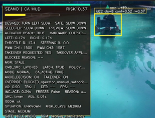

<div align="center">

# SEANO Collision Avoidance

**Sistem collision avoidance berbasis visi untuk Unmanned Surface Vehicle (USV) SEANO**


</div>

---

Repository ini berisi sistem *collision avoidance* USV SEANO yang berjalan pada ROS 2 Humble dan NVIDIA Jetson.

Sistem memanfaatkan kamera dan YOLOv8n TensorRT untuk mendeteksi objek, mengevaluasi risiko tabrakan berdasarkan informasi visual, menentukan tindakan penghindaran, dan mengintegrasikannya dengan sistem kendali SEANO melalui mekanisme *guarded AUTO takeover*.

> [!IMPORTANT]
> Runtime utama yang digunakan saat ini adalah `run_ca.sh`. Dokumentasi pada README ini difokuskan pada runtime tersebut.

## Menjalankan Sistem

Setelah Jetson dan sistem utama SEANO selesai melakukan startup:

```bash
cd ~/resource_git/seano-collision-avoidance2/seano_ca_ws
./run_ca.sh
```

Launcher akan menyiapkan environment ROS 2, workspace, konfigurasi runtime, pemeriksaan keselamatan, HUD, logging, dan sistem AUTO takeover.

Sebelum runtime aktif, operator akan diminta melakukan konfirmasi:

```text
Ketik YES untuk menjalankan CA:
```

Masukkan:

```text
YES
```

Untuk menghentikan runtime gunakan:

```text
Ctrl+C
```

pada terminal yang menjalankan `run_ca.sh`.

---

## Ringkasan Sistem

| Komponen | Implementasi |
|---|---|
| Platform komputasi | NVIDIA Jetson |
| Middleware | ROS 2 Humble |
| Persepsi | Kamera 640 × 480 |
| Object detection | YOLOv8n TensorRT |
| Input inference | 416 × 416 |
| Evaluasi risiko | Visual collision-risk assessment |
| Mekanisme kendali | Guarded AUTO takeover |
| Kendali operator | MANUAL tetap menjadi prioritas |
| Monitoring | Browser HUD dan ROS topics |
| Logging | Session-based runtime artifacts |

---

## Arsitektur


```mermaid
flowchart LR
    A["Kamera"] --> B["YOLOv8n<br/>TensorRT"]
    B --> C["Deteksi<br/>Objek"]
    C --> D["Evaluasi<br/>Risiko"]
    D --> E["Keputusan<br/>Collision Avoidance"]
    E --> F["Safety &<br/>Watchdog"]
    F --> G["AUTO Takeover<br/>Manager"]
    G --> H["Sistem Kendali<br/>SEANO"]

    classDef perception fill:#e8f4fd,stroke:#2980b9,color:#111;
    classDef decision fill:#fff4df,stroke:#d68910,color:#111;
    classDef safety fill:#fce8e6,stroke:#c0392b,color:#111;
    classDef control fill:#e9f7ef,stroke:#239b56,color:#111;

    class A,B,C perception;
    class D,E decision;
    class F safety;
    class G,H control;
```

Pipeline utama terdiri dari empat bagian:

| Bagian | Fungsi |
|---|---|
| Persepsi | Akuisisi kamera dan deteksi objek |
| Evaluasi | Mengolah parameter visual dan menghitung risiko |
| Keputusan | Menentukan tindakan collision avoidance |
| Kendali | Menjalankan mekanisme takeover secara terjaga |

---

## Penilaian Risiko

Setiap objek yang terdeteksi dievaluasi menggunakan beberapa indikator visual utama:

| Parameter | Fungsi |
|---|---|
| `proximity` | Menggambarkan kedekatan relatif objek |
| `centrality` | Menilai posisi objek terhadap jalur depan kapal |
| `approach` | Mengamati kecenderungan objek mendekat |
| `bearing_consistency` | Mengamati perubahan arah relatif objek |
| `vTTC` | Mengestimasi waktu visual menuju potensi tabrakan |

Nilai tersebut diproses menjadi *risk score* yang selanjutnya digunakan oleh policy collision avoidance.

---

## Perintah Collision Avoidance

Sistem dapat menghasilkan perintah berikut:

| Command | Fungsi |
|---|---|
| `HOLD_COURSE` | Mempertahankan kondisi navigasi |
| `SLOW_DOWN` | Mengurangi kecepatan |
| `TURN_LEFT_SLOW` | Belok port dengan respons lambat |
| `TURN_RIGHT_SLOW` | Belok starboard dengan respons lambat |
| `TURN_LEFT` | Belok port |
| `TURN_RIGHT` | Belok starboard |
| `STOP` | Menghentikan gerak melalui jalur keselamatan |

Perintah dari evaluator tidak langsung diterapkan ke kendaraan. Jalur aktuasi tetap melewati pemeriksaan state, freshness, control authority, komunikasi, dan safety gate.

---

## AUTO Takeover

Runtime dapat dijalankan tanpa mengharuskan kendaraan berada pada kondisi kontrol tertentu saat startup.

Persepsi, deteksi, evaluasi risiko, HUD, dan monitoring dapat tetap aktif ketika kendaraan sedang MANUAL maupun DISARMED.

Kendali collision avoidance baru menjadi eligible ketika kondisi berikut terpenuhi:

```text
AUTO + ARMED + SOFTWARE_READY
```

Pada kondisi tersebut runtime masuk ke:

```text
AUTO_MISSION_MONITORING
```

Siklus kendali utama:

| Tahap | Kondisi |
|---|---|
| Monitoring | Kapal berada pada AUTO dan sistem siap |
| Hazard | Risiko yang valid terkonfirmasi |
| Takeover | CA meminta transisi kendali yang diperlukan |
| Avoidance | Perintah collision avoidance dijalankan |
| Clear | Hazard tidak lagi memerlukan intervensi |
| Release | Authority CA dilepas |
| Rejoin | Kendaraan kembali ke AUTO mission monitoring |

---

## Prioritas Kendali Operator

**Operator selalu memiliki prioritas terhadap collision avoidance.**

Jika operator memilih MANUAL atau melakukan DISARM, runtime CA tidak harus dimatikan dan tidak menganggap intervensi operator sebagai fault fatal.

State akan masuk ke kondisi:

```text
OPERATOR_OVERRIDE
```

Authority CA dilepas, tetapi pipeline persepsi dan monitoring tetap berjalan.

Ketika kendaraan kembali memenuhi:

```text
AUTO + ARMED + SOFTWARE_READY
```

runtime dapat kembali ke:

```text
AUTO_MISSION_MONITORING
```

Mekanisme tersebut dapat berlangsung berulang kali selama satu sesi runtime.

> [!NOTE]
> Sistem collision avoidance tidak melakukan ARM atau DISARM secara otomatis. Keputusan tersebut tetap berada pada operator dan sistem autopilot kendaraan.

---

## Konfigurasi Aktif

Konfigurasi kendaraan berada pada:

```text
seano_ca_ws/src/seano_vision/config/alfin7_hardware_light.yaml
```

Parameter utama yang saat ini digunakan:

| Parameter | Nilai |
|---|---:|
| Resolusi citra | 640 × 480 |
| Camera HFOV | 67.5° |
| CENTER band ratio | 0.35 |
| Area CENTER ekuivalen | ±11.8125° |
| Minimum detection score evaluator | 0.45 |
| Enter avoidance | 0.45 |
| Exit avoidance | 0.28 |
| Slow threshold | 0.35 |
| Turn slow threshold | 0.45 |
| Turn threshold | 0.60 |
| Stop threshold | 0.78 |

Area CENTER merepresentasikan area di depan kapal. Posisi objek terhadap CENTER digunakan sebagai salah satu dasar untuk menentukan respons penghindaran ke sisi *port* atau *starboard*.

---

## Model Deteksi

Runtime menggunakan:

```text
Model      : YOLOv8n
Backend    : TensorRT
Precision  : FP16
Input      : 416 × 416
```

Source model:

```text
seano_ca_ws/src/seano_vision/models/yolov8n.pt
```

Engine yang digunakan pada Jetson:

```text
seano_ca_ws/src/seano_vision/models/yolov8n.engine
```

TensorRT engine bersifat bergantung pada lingkungan GPU, CUDA, dan TensorRT target. Karena itu file engine harus sesuai dengan Jetson tempat sistem dijalankan.

---

## Integrasi dengan SEANO

Collision avoidance menggunakan interface yang sudah tersedia pada sistem utama kendaraan.

```text
MAVROS
/usv/thruster
/mavros/set_mode
MQTT
```

Konfigurasi ROS runtime:

```text
ROS_DOMAIN_ID=0
```

Repository collision avoidance tidak menggantikan startup service utama SEANO dan tidak menjalankan MAVROS kedua.

Jalur kontrol `/usv/thruster` tetap digunakan sebagai interface aktuator eksternal kendaraan.

Credential dan konfigurasi sensitif MQTT disimpan di luar repository.

---

## HUD dan Monitoring

Runtime menyediakan HUD untuk memantau kondisi collision avoidance secara langsung.

<p align="center">
  
</p>

<p align="center">
  <em>Contoh tampilan HUD collision avoidance SEANO.</em>
</p>

Topic HUD utama:

```text
/ca/auto_takeover/debug_image
```

Browser stream:

```text
http://<JETSON_IP>:8080/stream?topic=/ca/auto_takeover/debug_image
```

HUD menampilkan informasi seperti:

- objek yang terdeteksi;
- *risk score* dan kelas risiko;
- keputusan collision avoidance;
- FCU mode dan status ARM;
- state AUTO takeover;
- status safety gate;
- blocked reason;
- abort reason.

Topic utama untuk inspeksi runtime:

```text
/ca/auto_takeover/status_json
/ca/metrics
/ca/watchdog_status
/camera/detections
/seano/camera/image_raw_reliable
```

Contoh:

```bash
ros2 topic echo /ca/auto_takeover/status_json --once
```

---

## Runtime Log

Setiap sesi menghasilkan data runtime pada:

```text
runtime_artifacts/
```

Folder sesi digunakan untuk menyimpan bukti runtime seperti ROS log, event AUTO takeover, terminal log, data kontrol, serta log monitoring.

Console `run_ca.sh` menggunakan tampilan ringkas agar operator dapat fokus pada event penting seperti:

```text
[READY]
[SYSTEM]
[VISION]
[SAFETY]
[STATE]
[ERROR]
```

---

## Struktur Repository

```text
seano-collision-avoidance/
│
├── README.md
├── docs/
│   └── assets/
│
└── seano_ca_ws/
    │
    ├── run_ca.sh
    │
    ├── scripts/
    │   └── ca_pretty_console.py
    │
    └── src/
        └── seano_vision/
            │
            ├── config/
            │   └── alfin7_hardware_light.yaml
            │
            ├── launch/
            │   └── auto_takeover_test.launch.py
            │
            ├── models/
            │   └── yolov8n.pt
            │
            ├── seano_vision/
            │   ├── detector_node.py
            │   ├── risk_evaluator_node.py
            │   ├── watchdog_failsafe_node.py
            │   ├── auto_takeover_manager_node.py
            │   └── auto_takeover_state.py
            │
            └── test/
```

### File Utama

| File | Peran |
|---|---|
| `run_ca.sh` | Entry point runtime |
| `detector_node.py` | Deteksi objek |
| `risk_evaluator_node.py` | Evaluasi risiko dan keputusan |
| `watchdog_failsafe_node.py` | Monitoring kondisi keselamatan |
| `auto_takeover_manager_node.py` | Integrasi AUTO takeover dengan ROS |
| `auto_takeover_state.py` | State machine kendali |
| `alfin7_hardware_light.yaml` | Konfigurasi kendaraan |

---

## Status Verifikasi

Baseline runtime saat ini telah melalui automated test suite:

```text
308 passed
```

Runtime utama:

```text
./run_ca.sh
```

Platform pengujian:

```text
NVIDIA Jetson
ROS 2 Humble
YOLOv8n TensorRT
```

---

## Catatan Operasi

Sebelum menggunakan AUTO untuk pengujian lapangan, pastikan sistem kendaraan telah memenuhi persyaratan navigasi dan keselamatan autopilot.

Kondisi yang perlu diperiksa mencakup baterai, koneksi FCU, GPS atau solusi posisi, EKF, status ARM, emergency stop, dan kesiapan operator untuk mengambil kendali MANUAL.

> [!WARNING]
> Collision avoidance tidak menggantikan mekanisme keselamatan autopilot dan tidak digunakan untuk melewati pemeriksaan *pre-arm*, GPS/EKF, battery failsafe, geofence, atau proteksi kendaraan lainnya.

---

<div align="center">

**SEANO Collision Avoidance**

ROS 2 · Computer Vision · Edge AI · Autonomous Surface Vehicle

</div>
